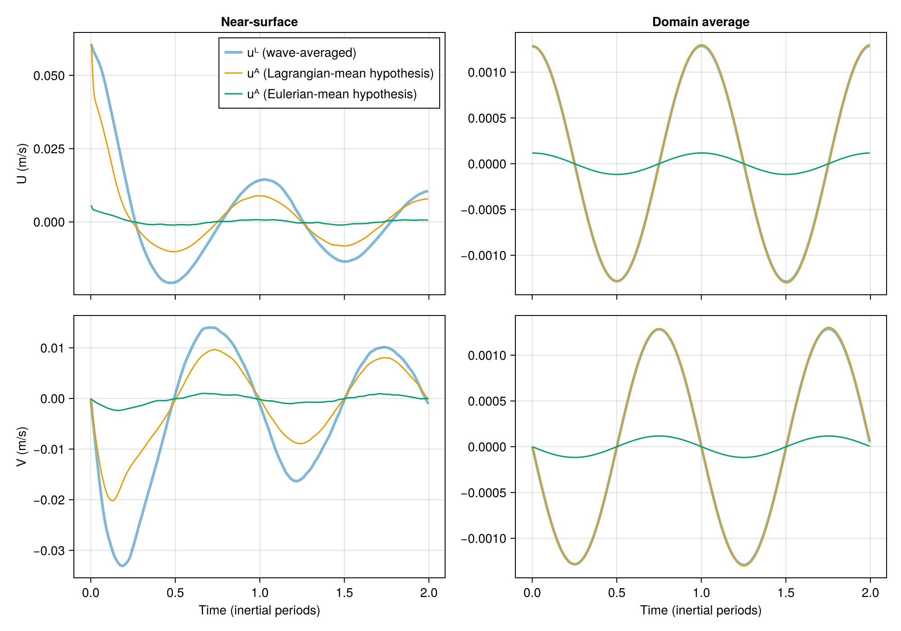
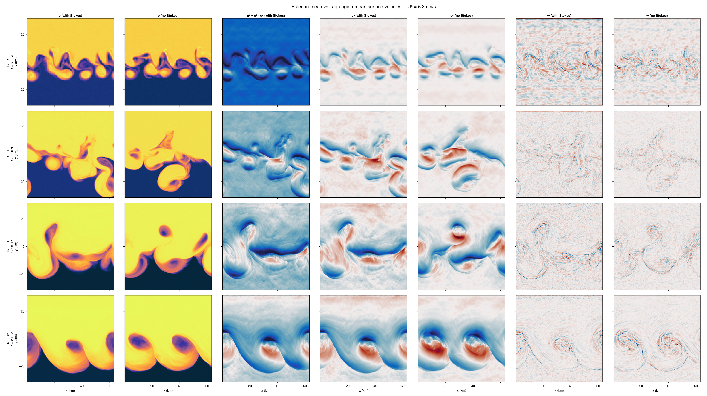

# Wave-averaged vs wave-agnostic ocean LES

Large eddy simulations comparing the Craik-Leibovich (wave-averaged) equations
against wave-agnostic simulations for three ocean turbulence problems.

## Motivation

The Craik-Leibovich (CL) equations model the effect of surface gravity waves on
ocean currents via the Stokes drift and the vortex force.
The prognostic velocity in CL is the **Lagrangian-mean velocity** uᴸ.
The **Eulerian-mean velocity** is uᴱ = uᴸ - uˢ, where uˢ is the Stokes drift.

A key question is: does the wave-averaged framework produce different results
from simply ignoring waves? We compare three velocities:

- **uᴸ** — Lagrangian-mean (CL prognostic variable)
- **uᴱ = uᴸ - uˢ** — Eulerian-mean (CL velocity minus Stokes drift)
- **uᴬ** — wave-agnostic (from a simulation with no Stokes drift)

All simulations use [Oceananigans.jl](https://github.com/CliMA/Oceananigans.jl)
with WENO(order=9) advection on a GPU.

## Simulations

### 1. Decaying near-inertial waves

Based on the initial value problem in Section 4 of
[Wagner et al. (2021)](https://doi.org/10.1175/JPO-D-20-0178.1).
A near-inertial current profile proportional to the Stokes drift decays via
turbulent mixing.

Three paired runs at 128³ (512 × 512 × 256 m, 2 inertial periods):
- `wave_averaged`: CL equations with Stokes drift, uᴸ(t=0) = 1.1 uˢ(z)
- `no_waves_lagrangian`: No Stokes drift, u(t=0) = 1.1 uˢ(z), matching uᴸ
- `no_waves_eulerian`: No Stokes drift, u(t=0) = 0.1 uˢ(z), matching uᴱ



The near-surface velocity evolution shows that the wave-averaged simulation
produces inertial oscillations whose amplitude and decay differ from
both wave-agnostic hypotheses.

### 2. Langmuir turbulence

Based on [McWilliams, Sullivan & Moeng (1997)](https://doi.org/10.1017/S0022112096004375).
Wind-driven shear turbulence with surface cooling, with and without Stokes drift.
The CL vortex force produces Langmuir circulations that deepen the mixed layer
faster than shear-driven turbulence alone.

### 3. Baroclinic adjustment

A density front in thermal wind balance undergoes baroclinic instability.
Two cases per Richardson number: `with_stokes` (CL) vs `no_stokes` (wave-agnostic).

Parameters:
- f = 10⁻⁴ s⁻¹, N² = 10⁻⁵ s⁻², front depth h = 100 m, total depth H = 200 m
- Domain: 20 Ld × 20 Ld × H (where Ld = √N² h / f ≈ 3.2 km)
- Wave parameters: amplitude = 0.8 m, wavelength = 60 m (Uˢ ≈ 6.8 cm/s)

The wave-to-geostrophic parameter Ps = f / (Ri ∂z uˢ) scales as 1/Ri:
waves become more important at low Ri where submesoscale instabilities dominate.

| Ri   | Ro = 1/√Ri | Ps      | Grid  | Stop time |
|------|------------|---------|-------|-----------|
| 10   | 0.32       | 7×10⁻⁴ | 128³  | 60 days   |
| 1    | 1.0        | 7×10⁻³ | 256³  | 37 days   |
| 0.1  | 3.2        | 0.07   | 256³  | 23 days   |
| 0.01 | 10         | 0.7    | 256³  | 20 days   |

#### Surface buoyancy and velocity at final time



Rows are Ri = 10, 1, 0.1, 0.01 (top to bottom). Columns show surface buoyancy
(with and without Stokes), Eulerian-mean velocity uᴱ, Lagrangian-mean velocity
uᴸ, wave-agnostic velocity uᴬ, and vertical velocity w.

At high Ri (quasi-geostrophic regime), the Stokes drift has little effect.
At low Ri (submesoscale/symmetric instability regime), the CL vortex force
modifies the frontal instability structure, and the difference between uᴸ
and uᴱ becomes significant relative to the flow itself.

## Running

```julia
julia --project simulations/baroclinic_adjustment.jl
julia --project simulations/near_inertial_waves.jl
julia --project simulations/langmuir_turbulence.jl
```

Plotting:
```julia
julia --project simulations/plot_eulerian_vs_lagrangian.jl
julia --project simulations/plot_baroclinic_adjustment.jl
julia --project simulations/plot_surface_velocity.jl
```

## References

- Wagner, G. L., Chini, G. P., Ramadhan, A., Gallet, B., & Ferrari, R. (2021).
  Near-inertial waves and turbulence driven by the growth of swell.
  *Journal of Physical Oceanography*, 51(5), 1337–1351.
- McWilliams, J. C., Sullivan, P. P., & Moeng, C.-H. (1997).
  Langmuir turbulence in the ocean. *Journal of Fluid Mechanics*, 334, 1–30.
